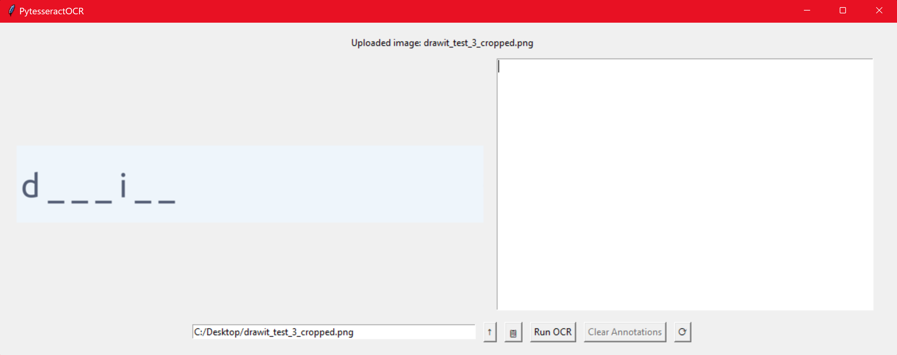
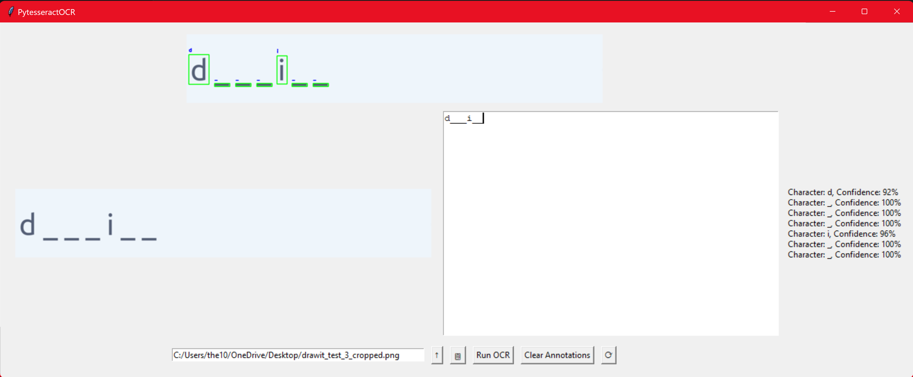
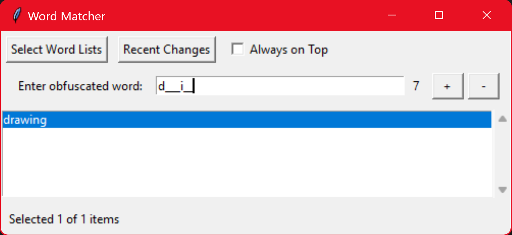
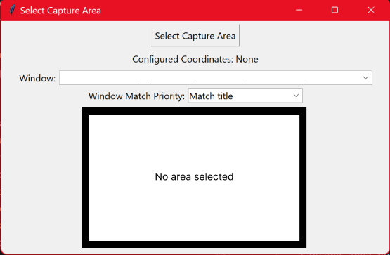
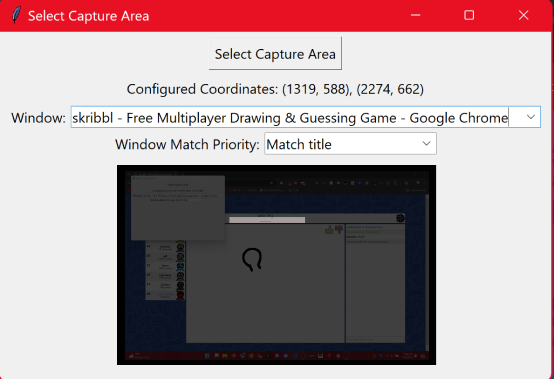

# Pictionary Bot

## Description
Pictionary Bot is a project aimed at automating the process of guessing drawing prompts in any online pictionary game. This project is a work in progress, featuring separate functionalities for Optical Character Recognition (OCR) and prompt-lookup.

### Current Capabilities
- **OCR Functionality:** The OCR tool can process images containing strings of underscores interspersed with sparse characters (limited to the alphabet, periods, and hyphens). It constantly monitors a selected area of the screen, similar to OBS window capture but using Python libraries like OpenCV.
- **Prompt-Lookup Tool:** This tool allows users to input an obfuscated prompt and retrieve possible matches from a database. Note that the prompt databases may not be up-to-date with the pictionary games they represent.

### Project Goals
The ultimate goal of Pictionary Bot is to create an app that can automate the guessing process in pictionary games. As an avid player, I've noticed that frequent gameplay leads to memorizing prompts based on their length and structure. This project aims to leverage that pattern recognition into an automated tool.

### Planned Features
1. **Real-Time Monitoring:**
   - Use OCR to continuously scan the game window for obfuscated prompts.
   - Detect and update the prompt as new letters replace underscores.

2. **Confidence-Based Filtering:**
   - Calculate the confidence of each OCR-detected letter and average it to determine the overall confidence of the guessed prompt.
   - Display possible matches with a confidence score, color-coded for easy reference (green for high confidence, red for low).

3. **Chat Monitoring (Future Implementation):**
   - Monitor game chat to track incorrect guesses made by other players.
   - Exclude these incorrect guesses from the prompt-lookup to further narrow down possible matches.

4. **User Interaction:**
   - Load the app window and access settings.
   - Select the application window and define the capture areas for the prompt and chat.
   - Start and stop recording the capture areas.
   - View a scrollable list of possible prompt matches, dynamically updated as more OCR data is processed.
   - Copy selected guesses to the clipboard with a simple key command (Ctrl + C).

### Future Steps
- **Integration of Chat Monitoring:** Enhance the app's efficiency by using chat data to filter out incorrect guesses.
- **Improvement of OCR Accuracy:** Fine-tune the OCR tool to handle a wider variety of character types and obfuscation patterns.
- **Database Updates:** Ensure that the prompt database is regularly updated to match the current prompt sets used in popular pictionary games.

## Usage for OCR Testing
1. **Browse for an Image:** Use the `↑` button to select an image.
2. **Paste from Clipboard:** Use the `📋` button or `Ctrl + V` to paste an image.
3. **Run OCR:** Click `Run OCR` to process the image.
4. **Clear Annotations:** Click `Clear Annotations` to reset.
5. **Reload Script:** Click `⟳` to restart.




## Usage for Word Lookup Testing
1. **Browse for an Image:** Use the `Browse` button.
2. **Select Word Lists:** Choose from preloaded text files.
3. **Add/Remove Words:** Use `+` or `-` buttons to modify word lists.
4. **Always On Top:** Toggle this option for the app window.
5. **Navigate Matches:** Use arrow keys to scroll through matches.



## Usage for Capture Area Testing (WIP)
1. **Select Capture Area:** Click the `Select Capture Area` button.
2. **Configure Coordinates:** The coordinates of the selected area will be displayed.
3. **Window Selection:** Choose a window from the dropdown menu.
4. **Window Match Priority:** Select the priority for matching windows (by executable or title).
5. **Preview Area (WIP):** The selected capture area or full window will be displayed in the preview section.

**Note:** The preview section is still a work in progress. The images below are concepts and may not reflect the current committed code.




## Installation
Currently not meant for installation, but you can explore the OCR and word lookup functionalities:
1. Clone the repository:
   ```bash
   git clone https://github.com/MilesMoosavi/pictionary-bot.git
   cd pictionary-bot
   ```
2. Install the required dependencies:
   ```bash
   pip install -r requirements.txt
   ```

## Contributing
This project is for version control. Contributions are welcome via issues or pull requests.
 
## License
Licensed under the MIT License.